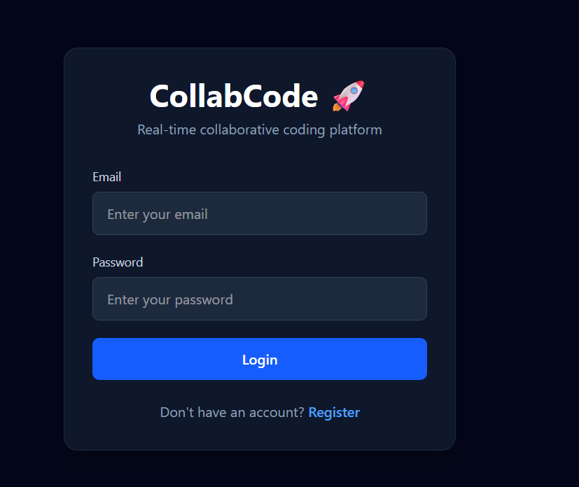
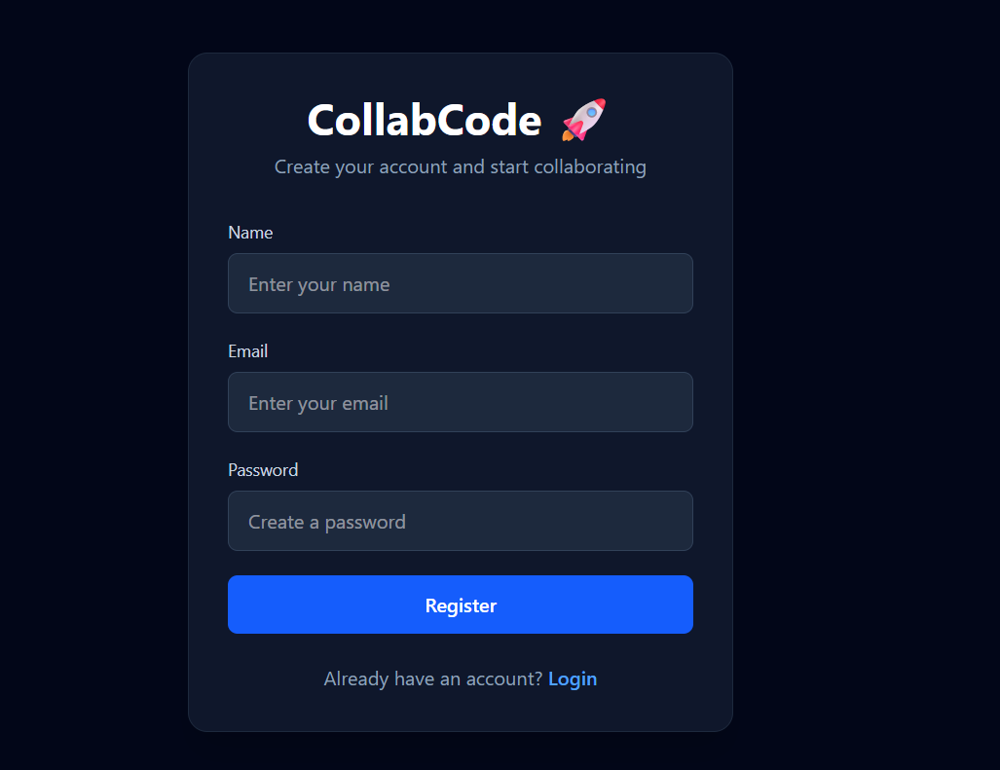
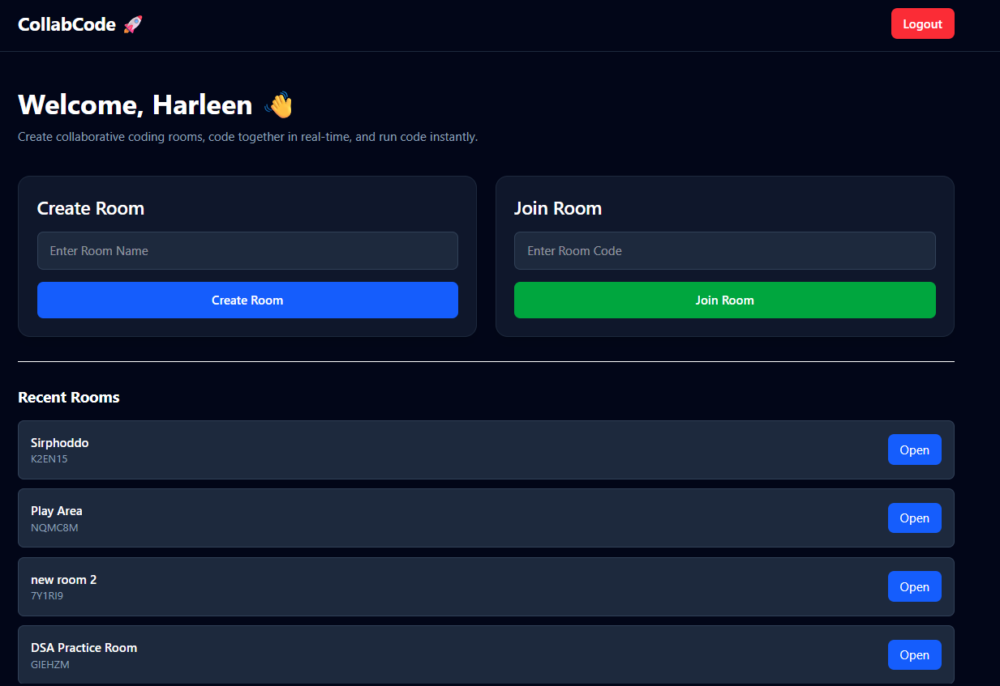
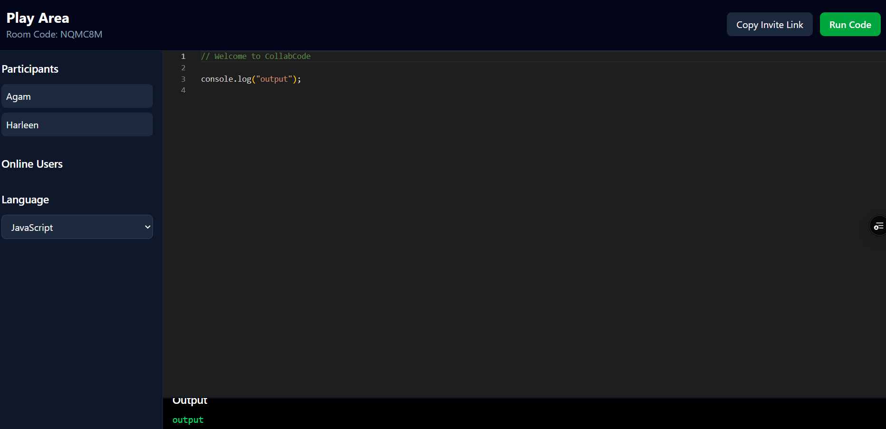

# 🚀 CollabCode

A real-time collaborative coding platform that enables multiple users to code together, communicate through shared rooms, and execute code in multiple programming languages.

## 🌟 Features

### 🔐 Authentication

* User Registration & Login
* JWT-based Authentication
* Protected Routes
* Persistent User Sessions

### 👥 Collaborative Rooms

* Create Coding Rooms
* Join Existing Rooms via Room Code
* Invite Others with Shareable Links
* Room-Based Access Control

### ⚡ Real-Time Collaboration

* Live Code Synchronization using Socket.IO
* Real-Time Online User Tracking
* Shared Language Selection
* Instant Updates Across Connected Users

### 💻 Multi-Language Code Execution

Supports:

* JavaScript
* TypeScript
* Python
* Java
* C++

Code execution powered by Judge0 API.

### 💾 Auto Save

* Automatic code persistence
* Room state stored in MongoDB
* Users can continue where they left off

### 🎨 Modern UI

* Responsive Design
* Dark Theme Workspace
* Monaco Editor Integration
* Clean Developer Experience

---

## 🛠️ Tech Stack

### Frontend

* React
* TypeScript
* Vite
* Tailwind CSS
* Axios
* React Router DOM
* Monaco Editor
* Socket.IO Client

### Backend

* Node.js
* Express.js
* TypeScript
* MongoDB Atlas
* Mongoose
* Socket.IO
* JWT Authentication
* bcryptjs

### Deployment

* Frontend: Vercel
* Backend: Render
* Database: MongoDB Atlas

---

## 📸 Screenshots

1. Login Page

2. Register Page

3. Dashboard

4. Collaborative Editor

5. Code Execution Output


---

## ⚙️ Installation

### Clone Repository

```bash
git clone https://github.com/Harleenkaur1712/CollabCode.git
cd collabcode
```

### Backend Setup

```bash
cd server

npm install
```

Create `.env`

```env
MONGO_URI=your_mongodb_connection_string

JWT_SECRET=your_jwt_secret
```

Run Backend

```bash
npm run dev
```

### Frontend Setup

```bash
cd client

npm install
```

Create `.env`

```env
VITE_API_URL=http://localhost:5000/api
```

Run Frontend

```bash
npm run dev
```

---

## 📂 Project Structure

```text
collabcode/
│
├── client/
│   ├── src/
│   ├── components/
│   ├── pages/
│   ├── api/
│   └── socket/
│
├── server/
│   ├── src/
│   ├── controllers/
│   ├── routes/
│   ├── models/
│   ├── middleware/
│   └── config/
│
└── README.md
```
---


